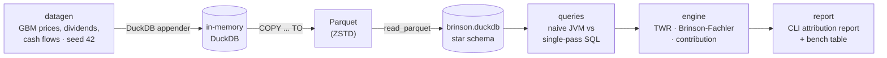

# brinson — Portfolio Performance & Attribution Engine


A compact analytics engine that computes time-weighted returns and Brinson-Fachler
performance attribution for equity portfolios, built in Kotlin on embedded DuckDB. A
synthetic-data ETL pipeline (generator → Parquet → DuckDB) feeds a star-schema fact table,
and the same attribution math is implemented twice — once as naive JVM-side aggregation,
once as single-pass columnar SQL — to make the optimization win measurable:
**Brinson-Fachler attribution over 10.4M position rows runs in 1.31 s in DuckDB —
6.7x faster than the naive JVM aggregation, with both paths agreeing to within 5.2e-17.**

## The finance, in two paragraphs

**Time-Weighted Return (TWR)** answers "how well did the manager invest?" independently of
when clients moved money in or out. A portfolio that receives a large deposit right before a
bad week would look terrible on a simple start/end calculation even if every investment
decision was sound. TWR fixes this by cutting time into sub-periods at each external cash
flow, computing the return of each sub-period in isolation, and compounding them:
`TWR = ∏(1 + r_t) − 1`. Here cash flows are assumed to arrive at the start of day:
`r_t = (MV_end − MV_begin − CF) / (MV_begin + CF)`.

**Brinson-Fachler attribution** answers "*where* did the manager beat (or trail) the
benchmark?" It decomposes active return (portfolio return minus benchmark return) by sector
into three effects. **Allocation** — did overweighting/underweighting whole sectors help?
`(wp_i − wb_i)(rb_i − rb)`. **Selection** — within each sector, did the manager pick better
securities than the index? `wb_i(rp_i − rb_i)`. **Interaction** — the cross term
`(wp_i − wb_i)(rp_i − rb_i)`. The three effects sum *exactly* to the active return — that
identity is enforced in the test suite to 1e-10. Across multiple days the report compounds
effects with **Cariño log-linking**, so multi-period totals reconcile exactly to the
geometric active return rather than drifting the way naive arithmetic sums do. All formulas,
conventions, and fully hand-worked examples live in
[docs/METHODOLOGY.md](docs/METHODOLOGY.md).

## Architecture



The schema is a small star: `positions_daily` (the 10M+ row fact table) plus `securities`,
`portfolios`, `transactions`, `benchmark_weights`, and `benchmark_returns` dimensions/facts.
One deliberate deviation from convention: the benchmark return column is named `ret`
because `return` is a reserved word in several SQL dialects.

## Benchmark: naive vs. optimized

Both paths compute identical full-history Brinson-Fachler effects (sum of daily effects per
sector) for all 50 portfolios at once — equality is asserted before timing, and again in the
test suite at small scale. The difference is *where* the aggregation happens:

- **Naive** — pull the entire fact table over JDBC and aggregate row-at-a-time in JVM hash
  maps (the classic ORM-shaped approach).
- **Optimized** — one set-based SQL statement: a window-function `lag` for prior-close
  weights, CTE joins, and grouped aggregation, all executed inside DuckDB's vectorized
  columnar engine; the JVM reads back 550 result rows.

Full-history attribution (504 trading days, 50 portfolios, **10,377,750** position rows),
median of 5 runs after 1 warmup, produced by `brinson bench`:

| Variant | Median | Runs (ms) |
|---|---|---|
| naive (JDBC transfer + JVM hash aggregation) | 8,785 ms | 8543, 8785, 8741, 8883, 8959 |
| optimized (single-pass SQL in DuckDB) | **1,314 ms (6.7x faster)** | 1326, 1337, 1291, 1266, 1314 |
| optimized (SQL directly over Parquet) | 1,364 ms (6.4x faster) | 1354, 1442, 1438, 1364, 1351 |

Hardware: 4-core Linux amd64 container, JVM max heap 4 GB (DuckDB works off-heap).
Before timing, the harness asserts both paths return the same effects
(max abs difference observed: 5.2e-17).

Honest framing: the naive path is not a strawman — the math and even the scan order are
identical; it pays for moving 10.4M rows across the JDBC boundary and aggregating them
row-at-a-time on the JVM heap. The optimized path demonstrates the actual engineering
lesson: push set-based math into the columnar engine and move results, not rows.
The annotated `EXPLAIN ANALYZE` plan is in [docs/QUERY_PLAN.md](docs/QUERY_PLAN.md)
(`brinson bench --explain` regenerates it).

### Scaling

Same benchmark across data sizes (`--scale` 0.1 → 2.0, median of 3 runs after warmup;
at scale 2.0 holdings saturate against the 500-security universe). All timings in this
section and the table above come from the same session on the same hardware; the
full-scale row here repeats the headline configuration with 3 runs instead of 5, and the
medians agree to within 1%:

| Rows | Naive | µs/row | Optimized | µs/row | Speedup |
|---|---|---|---|---|---|
| 1,059,995 | 1,389 ms | 1.31 | 225 ms | 0.21 | 6.2x |
| 2,610,850 | 2,858 ms | 1.09 | 416 ms | 0.16 | 6.9x |
| 5,244,930 | 5,023 ms | 0.96 | 775 ms | 0.15 | 6.5x |
| 10,377,750 | 8,812 ms | 0.85 | 1,304 ms | 0.13 | 6.8x |
| 12,123,535 | 10,080 ms | 0.83 | 1,449 ms | 0.12 | 7.0x |

Both paths are mildly *sublinear* — per-row cost falls ~35-40% from 1M to 12M rows as
fixed overhead (JIT warmup, query setup) amortizes — and the gap between them is a
roughly constant ~6-7x: the price of moving rows across the JDBC boundary instead of
aggregating them where they live. Put differently: the optimized path processes 12.1M
rows in roughly the time the naive path needs for 1M.

## Sample report

```
==============================================================================
Portfolio 007  |  2024-01-03 .. 2025-12-08  (504 trading days)
==============================================================================

  TWR (portfolio):          +33.18%   (annualized +15.98%)
  TWR (benchmark):          +25.51%   (annualized +12.47%)
  Active return:             +7.67%   (geometric: +6.11%)
  Tracking error (ann):      +2.49%   (IR: 1.19,  max drawdown: -16.97%)

Brinson-Fachler attribution by sector  (Carino-linked daily effects, in bps)
------------------------------------------------------------------------------
  Sector                       wp     wb     Alloc    Select  Interact     Total
  Real Estate               15.2%   6.5%     -18.0    +212.5    +273.5    +467.9
  Energy                     5.2%  10.5%    +213.1    +109.7     -56.2    +266.6
  Consumer Discretionary    11.3%   9.6%     +19.3    +116.2     +16.7    +152.1
  Industrials                7.0%   7.3%      +8.2     +79.5      -5.9     +81.9
  Utilities                  5.9%   7.3%     +36.9     +29.2      -7.6     +58.5
  Health Care                9.6%   8.1%      +5.6     +43.1      +5.1     +53.8
  Communication Services    13.2%   7.4%     -16.0     +26.3     +16.8     +27.1
  Financials                 6.7%   7.5%     -10.8     +40.5      -6.1     +23.5
  Materials                  8.0%  14.1%    -104.8     +84.3     -40.4     -60.9
  Information Technology     9.6%   9.7%     -12.9     -84.9      -0.9     -98.6
  Consumer Staples           8.2%  11.9%     -74.3    -188.5     +58.1    -204.7
------------------------------------------------------------------------------
  TOTAL                      100%   100%     +46.3    +467.9    +253.0    +767.2
  (Carino-linked: totals reconcile to the geometric active return; METHODOLOGY.md)

Top contributors (sum of daily w*r, in bps)
------------------------------------------------------------------------------
  SEC418   Real Estate                 +257.4
  SEC442   Materials                   +124.1
  SEC484   Real Estate                  +93.3
  SEC290   Consumer Discretionary       +85.6
  SEC264   Real Estate                  +85.6
  ...
  SEC038   Consumer Staples             -17.3
  SEC151   Information Technology       -24.2
  SEC406   Utilities                    -25.1
```

## Dashboard

A static, dependency-free dashboard over all 50 portfolios — portfolio picker, date-range
presets, cumulative TWR vs benchmark, risk cards (tracking error, information ratio, max
drawdown), the Cariño-linked attribution waterfall, contributors, and weekly sector weights:

```bash
build/install/brinson/bin/brinson dashboard   # bakes docs/dashboard/{index.html,data.json}
```

The site is committed under `docs/dashboard/` and hosted free on **GitHub Pages**
(Settings → Pages → Deploy from a branch → `main` / `docs`); range recomputation happens
client-side from the baked daily return series using the METHODOLOGY.md formulas.
(Opening `index.html` from the filesystem won't work — `fetch` needs HTTP; use Pages or
`python3 -m http.server` in the directory.)

## Live backend

`brinson serve` runs the same dashboard against a **live backend** — a zero-dependency HTTP
server (JDK built-in) that computes the dashboard JSON from the DuckDB file at boot and
serves it alongside the static assets:

```bash
build/install/brinson/bin/brinson serve            # http://localhost:8080
# GET /            the dashboard          GET /api/data    live JSON (CORS: *)
# GET /healthz     liveness probe         GET /data.json   alias of /api/data
```

The frontend resolves its data source in order: `?api=<url>` query override → `api/data`
(present when served by the backend) → `data.json` (the baked static file on GitHub Pages).
One bundle, three deployment modes.

**Deploying (e.g. Railway):** the repo's `Dockerfile` builds the app and **bakes the seeded
dataset into the image at build time** — deterministic generation means the deployed data
is bit-for-bit the data behind the benchmark numbers, and containers cold-start instantly.
`$PORT` is honored automatically. Build with `--build-arg SCALE=0.25` for small instances
(the full-scale boot query wants ~2 GB of memory).

## Quickstart

```bash
./gradlew installDist
build/install/brinson/bin/brinson generate && build/install/brinson/bin/brinson load
build/install/brinson/bin/brinson report --portfolio 7   # or: bench
```

(`./gradlew test` runs the golden, invariant, property, and equivalence suites.)

Full-scale `generate` simulates into an in-memory DuckDB before the Parquet dump — budget
~4 GB free RAM, or pass `--scale 0.1` for a laptop-friendly run. `bench` takes about a
minute at defaults; the five ~9 s naive runs dominate.

## Future Work

- **Multi-currency** portfolios and currency-allocation effects
- **ClickHouse / distributed scale** for fact tables beyond a single node
- **AWS deployment** (S3 Parquet lake + scheduled attribution jobs)
- **Money-weighted returns (IRR)** alongside TWR
