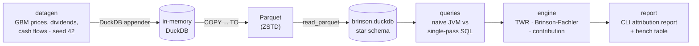

# brinson — Portfolio Performance & Attribution Engine

A compact analytics engine that computes time-weighted returns and Brinson-Fachler
performance attribution for equity portfolios, built in Kotlin on embedded DuckDB. A
synthetic-data ETL pipeline (generator → Parquet → DuckDB) feeds a star-schema fact table,
and the same attribution math is implemented twice — once as naive JVM-side aggregation,
once as single-pass columnar SQL — to make the optimization win measurable:
**Brinson-Fachler attribution over 10.4M position rows runs in 1.33 s in DuckDB —
5.0x faster than the naive JVM aggregation, with both paths agreeing to within 3.5e-17.**

## The finance, in two paragraphs

**Time-Weighted Return (TWR)** answers "how well did the manager invest?" independently of
when clients moved money in or out. A portfolio that receives a large deposit right before a
bad week would look terrible on a simple start/end calculation even if every investment
decision was sound. TWR fixes this by cutting time into sub-periods at each external cash
flow, computing the return of each sub-period in isolation, and compounding them:
`TWR = ∏(1 + r_t) − 1`. Here cash flows are assumed to arrive at the start of day:
`r_t = (MV_end − MV_begin − CF) / (MV_begin + CF)`.

**Brinson-Fachler attribution** answers "*where* did the manager beat (or trail) the
benchmark?" It decomposes active return (portfolio return minus benchmark return) by sector
into three effects. **Allocation** — did overweighting/underweighting whole sectors help?
`(wp_i − wb_i)(rb_i − rb)`. **Selection** — within each sector, did the manager pick better
securities than the index? `wb_i(rp_i − rb_i)`. **Interaction** — the cross term
`(wp_i − wb_i)(rp_i − rb_i)`. The three effects sum *exactly* to the active return — that
identity is enforced in the test suite to 1e-10. All formulas, conventions, and a fully
hand-worked example live in [docs/METHODOLOGY.md](docs/METHODOLOGY.md).

## Architecture



The schema is a small star: `positions_daily` (the 10M+ row fact table) plus `securities`,
`portfolios`, `transactions`, `benchmark_weights`, and `benchmark_returns` dimensions/facts.
One deliberate deviation from convention: the benchmark return column is named `ret`
because `return` is a reserved word in several SQL dialects.

## Benchmark: naive vs. optimized

Both paths compute identical full-history Brinson-Fachler effects (sum of daily effects per
sector) for all 50 portfolios at once — equality is asserted before timing, and again in the
test suite at small scale. The difference is *where* the aggregation happens:

- **Naive** — pull the entire fact table over JDBC and aggregate row-at-a-time in JVM hash
  maps (the classic ORM-shaped approach).
- **Optimized** — one set-based SQL statement: a window-function `lag` for prior-close
  weights, CTE joins, and grouped aggregation, all executed inside DuckDB's vectorized
  columnar engine; the JVM reads back 550 result rows.

Full-history attribution (504 trading days, 50 portfolios, **10,377,750** position rows),
median of 5 runs after 1 warmup, produced by `brinson bench`:

| Variant | Median | Runs (ms) |
|---|---|---|
| naive (JDBC transfer + JVM hash aggregation) | 6,683 ms | 6808, 6362, 6683, 7375, 6333 |
| optimized (single-pass SQL in DuckDB) | **1,333 ms (5.0x faster)** | 1393, 1291, 1333, 1277, 1338 |
| optimized (SQL directly over Parquet) | 1,432 ms (4.7x faster) | 1480, 1409, 1403, 1454, 1432 |

Hardware: 4-core Linux amd64 container, JVM max heap 4 GB (DuckDB works off-heap).
Before timing, the harness asserts both paths return the same effects
(max abs difference observed: 3.5e-17).

Honest framing: the naive path is not a strawman — the math and even the scan order are
identical; it pays for moving 10.4M rows across the JDBC boundary and aggregating them
row-at-a-time on the JVM heap. The optimized path demonstrates the actual engineering
lesson: push set-based math into the columnar engine and move results, not rows.

## Sample report

```
==============================================================================
Portfolio 007  |  2024-01-03 .. 2025-12-08  (504 trading days)
==============================================================================

  TWR (portfolio):          +33.18%   (annualized +15.98%)
  TWR (benchmark):          +25.51%   (annualized +12.47%)
  Active return:             +7.67%   (geometric: +6.11%)

Brinson-Fachler attribution by sector  (sum of daily effects, in bps)
------------------------------------------------------------------------------
  Sector                       wp     wb     Alloc    Select  Interact     Total
  Real Estate               15.2%   6.5%     -17.5    +164.4    +211.7    +358.6
  Energy                     5.2%  10.5%    +165.4     +85.1     -43.6    +206.9
  Consumer Discretionary    11.3%   9.6%     +14.8     +90.1     +12.9    +117.8
  Industrials                7.0%   7.3%      +6.4     +61.1      -4.5     +63.0
  Utilities                  5.9%   7.3%     +28.7     +22.4      -5.9     +45.3
  Health Care                9.6%   8.1%      +4.7     +33.5      +4.0     +42.2
  Communication Services    13.2%   7.4%     -10.8     +20.3     +13.0     +22.5
  Financials                 6.7%   7.5%      -8.4     +31.2      -4.7     +18.1
  Materials                  8.0%  14.1%     -82.3     +65.5     -31.4     -48.2
  Information Technology     9.6%   9.7%     -10.0     -65.4      -0.7     -76.1
  Consumer Staples           8.2%  11.9%     -58.1    -146.9     +45.3    -159.7
------------------------------------------------------------------------------
  TOTAL                      100%   100%     +32.9    +361.5    +196.0    +590.3
  (totals equal the arithmetic sum of daily active returns; see METHODOLOGY.md)

Top contributors (sum of daily w*r, in bps)
------------------------------------------------------------------------------
  SEC418   Real Estate                 +257.4
  SEC442   Materials                   +124.1
  SEC484   Real Estate                  +93.3
  SEC290   Consumer Discretionary       +85.6
  SEC264   Real Estate                  +85.6
  ...
  SEC038   Consumer Staples             -17.3
  SEC151   Information Technology       -24.2
  SEC406   Utilities                    -25.1
```

## Quickstart

```bash
./gradlew installDist
build/install/brinson/bin/brinson generate && build/install/brinson/bin/brinson load
build/install/brinson/bin/brinson report --portfolio 7   # or: bench
```

(`./gradlew test` runs the golden, invariant, property, and equivalence suites.)

Full-scale `generate` simulates into an in-memory DuckDB before the Parquet dump — budget
~4 GB free RAM, or pass `--scale 0.1` for a laptop-friendly run. `bench` takes about a
minute at defaults; the five ~7 s naive runs dominate.

## Built with Claude Code

<!-- TODO: Jon fills in workflow narrative -->

## Future Work

- **Multi-period attribution linking** (Cariño / Menchero smoothing) — daily effects are
  currently reported as arithmetic sums with the caveat documented in METHODOLOGY.md
- **Multi-currency** portfolios and currency-allocation effects
- **ClickHouse / distributed scale** for fact tables beyond a single node
- **AWS deployment** (S3 Parquet lake + scheduled attribution jobs)
- **Money-weighted returns (IRR)** alongside TWR
